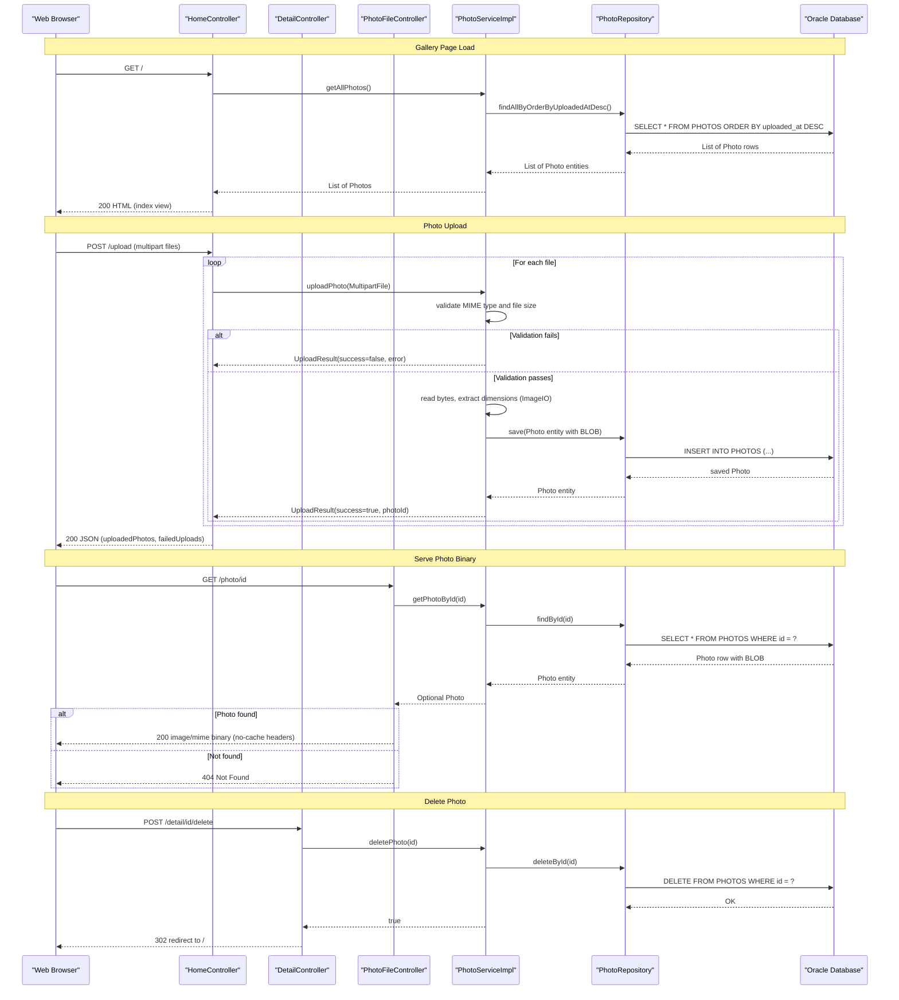

# API & Service Communication Contracts

The Photo Album application exposes 5 HTTP endpoints across 3 Spring MVC controllers, all served from a single monolithic Spring Boot service with no API gateway, service mesh, or inter-service communication.

## Service Catalog

| Service | Port | Category | Purpose |
|---------|------|----------|---------|
| photoalbum-java-app | 8080 | Business | Spring Boot web application serving the photo gallery UI and REST upload API |
| oracle-db | 1521 | Infrastructure | Oracle Database Free 23ai — sole data store for photo metadata and binary BLOB data |

## API Endpoints Inventory

| Service | Method | Path | Request Type | Response Type |
|---------|--------|------|-------------|---------------|
| HomeController | GET | `/` | — | HTML (index view with photo list) |
| HomeController | POST | `/upload` | `multipart/form-data` files param (`List<MultipartFile>`) | `200 OK` `Map<success, uploadedPhotos[], failedUploads[]>` / `400 Bad Request` |
| DetailController | GET | `/detail/{id}` | Path param: `id` (String) | HTML (detail view with Photo, previousPhotoId, nextPhotoId) / redirect to `/` if not found |
| DetailController | POST | `/detail/{id}/delete` | Path param: `id` (String) | Redirect to `/` with flash message (successMessage or errorMessage) |
| PhotoFileController | GET | `/photo/{id}` | Path param: `id` (String) | Binary image data (`image/jpeg`, `image/png`, etc.) with no-cache headers / `404` if not found / `500` on error |

## Management & Observability Endpoints

| Service | Endpoint | Custom Metrics |
|---------|----------|---------------|
| photoalbum-java-app | None | No Spring Boot Actuator configured; no `/actuator/health`, `/actuator/info`, or `/actuator/metrics` endpoints exposed |

No observability endpoints, health checks, or custom metrics annotations (`@Timed`, Micrometer) are present in the application.

## DTOs & Contracts

**Service-level domain classes** (all owned by the single `photo-album` service):

- **`Photo`** (JPA Entity / response object): Used as the model attribute in the Thymeleaf detail and index views. Carries photo metadata and binary data. See `data-architecture.md` for full field listing.
- **`UploadResult`** (value object / internal contract): Returned by `PhotoService.uploadPhoto()` to communicate upload outcome (success flag, assigned photo ID, original filename, error message) from the service layer to the controller. Not directly serialized to JSON — the controller maps it into an ad-hoc `Map<String, Object>`.
- **Ad-hoc upload response map**: The `POST /upload` endpoint returns a raw `Map<String, Object>` (not a typed DTO) with keys: `success`, `uploadedPhotos` (list of maps with id, originalFileName, filePath, uploadedAt, fileSize, width, height), and `failedUploads` (list of maps with fileName, error).

No OpenAPI/Swagger specification, protobuf schemas, or GraphQL schemas are present. Jackson is used for JSON serialization (via `spring-boot-starter-json`); no custom serializers are configured.

## Communication Patterns

**Synchronous patterns only**: All communication is synchronous HTTP request/response. There are no message queues, event brokers, or asynchronous patterns in use.

**No inter-service calls**: The application is a monolith — all controllers delegate directly to `PhotoServiceImpl` via the `PhotoService` interface through Spring's dependency injection. There is no HTTP client (RestTemplate, WebClient, Feign) for outbound calls.

**Data access**: `PhotoServiceImpl` accesses Oracle Database exclusively through Spring Data JPA (`PhotoRepository`), which is resolved at startup through Hibernate over an ojdbc8 JDBC connection.

**No resilience patterns**: No circuit breaker (Resilience4j, Spring Retry), retry policy, timeout configuration, or bulkhead pattern is configured. If the database is unavailable, requests fail with unhandled exceptions propagated to the caller.

**No service discovery**: Services communicate via hardcoded hostnames defined in `docker-compose.yml` (`oracle-db:1521`) and `application.properties`. No Eureka, Consul, or Kubernetes DNS-based discovery is used.

**Startup dependency chain**: The `photoalbum-java-app` container depends on `oracle-db` reaching a healthy state (via Docker Compose `depends_on: condition: service_healthy`) before starting. The Oracle healthcheck uses Oracle's built-in `healthcheck.sh` with a 180-second start period and up to 15 retries. If Oracle is not available at Spring Boot startup, the JPA datasource initialization will fail. See `configuration-inventory.md` for full configuration details.

**Security posture**: No authentication, authorization, or TLS is configured. All 5 endpoints are publicly accessible with no authorization checks. There is no `spring-boot-starter-security` dependency, no JWT/OAuth2 integration, and no CSRF protection. HTTP (not HTTPS) is used for all client-to-application communication.

## Service Technology Matrix

| Service | Web Framework | Data Access | Discovery | Gateway | Actuator/Health | Cache | Metrics |
|---------|--------------|-------------|-----------|---------|-----------------|-------|---------|
| photoalbum-java-app | Spring MVC (Servlet) | Spring Data JPA + Hibernate 5.6 | None (hardcoded URLs) | None | None | None | None |
| oracle-db | N/A | Oracle XE FREEPDB1 | None | None | Docker healthcheck.sh | N/A | None |

## Service Communication Sequence

