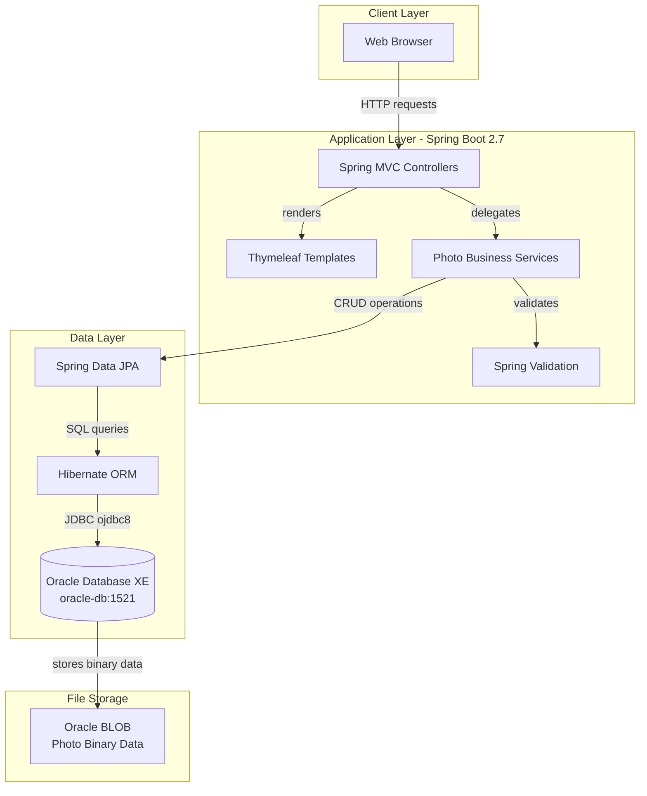
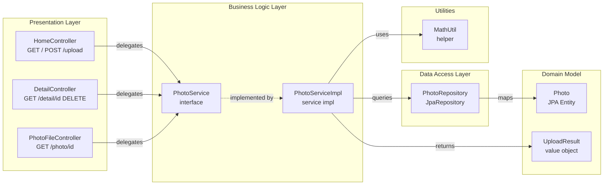

# Architecture Diagram

This document provides a two-layer architecture visualization of the Photo Album application: a high-level application architecture diagram showing major layers and integrations, and a detailed component relationship diagram showing how Spring components interact.

## Application Architecture

### Technology Stack Summary

| Layer | Technology | Version | Purpose |
|-------|-----------|---------|---------|
| Presentation | Spring MVC | 2.7.18 | Server-side web controllers |
| Presentation | Thymeleaf | 3.x | HTML template rendering |
| Business Logic | Spring Boot | 2.7.18 | Application framework and auto-configuration |
| Business Logic | Spring Validation | 2.7.18 | Input validation (file type, size) |
| Data Access | Spring Data JPA | 2.7.18 | Repository abstraction layer |
| Data Access | Hibernate ORM | 5.6.x | Object-relational mapping |
| Data Access | Oracle JDBC (ojdbc8) | runtime | Oracle database connectivity |
| Database | Oracle Database XE | FREEPDB1 | Primary relational database |
| Build | Maven | 3.x | Dependency management and build |
| Runtime | Java | 8 | JVM execution environment |

### Data Storage & External Services

The application uses a single Oracle Database (XE edition) instance as its sole data store. All photo binary data (image bytes) are stored directly as BLOB columns in the `PHOTOS` table alongside photo metadata (filename, MIME type, dimensions, file size, and upload timestamp). There are no external caching layers, message brokers, or third-party API integrations. The Oracle database is accessed via the `ojdbc8` driver over a JDBC thin connection (`jdbc:oracle:thin:@oracle-db:1521/FREEPDB1`), and Hibernate manages schema creation (`ddl-auto=create`) with `OracleDialect`.

### Key Architectural Decisions

- **BLOB storage in Oracle**: Photo binary data is stored directly in the database as BLOB columns rather than on the filesystem or an object store, simplifying deployment but creating tight coupling to Oracle.
- **Spring Data JPA repository pattern**: Data access is abstracted through a `JpaRepository` interface with custom JPQL queries for navigation (previous/next photo lookup by upload date).
- **Single-service, monolithic structure**: The entire application (web, business logic, data access) is packaged as a single Spring Boot executable JAR, with no separate microservices or external service dependencies.

## Component Relationships

### Component Inventory

| Component | Layer | Type | Responsibility |
|-----------|-------|------|----------------|
| HomeController | Presentation | Spring MVC Controller | Handles gallery page rendering (GET /) and multi-file photo upload (POST /upload) |
| DetailController | Presentation | Spring MVC Controller | Handles single photo view (GET /detail/{id}) and photo deletion (POST /detail/{id}/delete) |
| PhotoFileController | Presentation | Spring MVC Controller | Serves raw photo binary data from Oracle BLOB for `` tags (GET /photo/{id}) |
| PhotoService | Business Logic | Service Interface | Defines contract for all photo operations (getAllPhotos, getPhotoById, uploadPhoto, deletePhoto, getPreviousPhoto, getNextPhoto) |
| PhotoServiceImpl | Business Logic | Spring Service | Implements photo upload validation (MIME type, file size), UUID assignment, image dimension extraction via ImageIO, and transactional database interactions |
| PhotoRepository | Data Access | Spring Data JPA Repository | Provides CRUD operations and custom JPQL queries for ordered retrieval and navigation between photos |
| Photo | Domain Model | JPA Entity | Maps to PHOTOS database table; holds metadata (filename, MIME type, dimensions, size, timestamp) and BLOB photo data |
| UploadResult | Domain Model | Value Object | Carries upload operation outcome (success flag, photo ID, filename, error message) |
| MathUtil | Utilities | Utility Class | Provides arithmetic helper methods |
