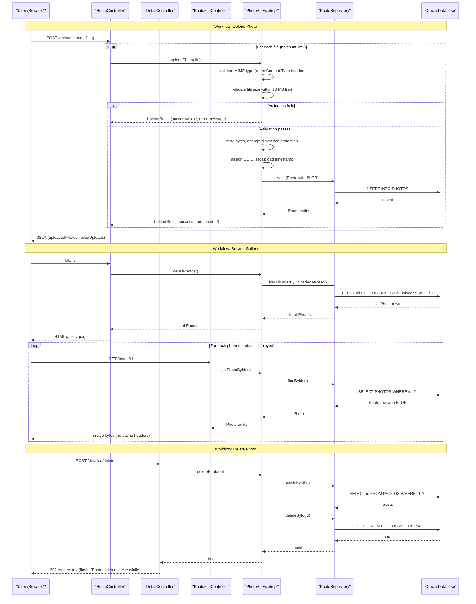

# Core Business Workflows

The Photo Album application allows users to upload, browse, and delete personal photos stored in a cloud database, providing a simple web-based gallery with navigation between individual photos.

## Domain Entities

| Entity | Service / Bounded Context | Description | Key Relationships |
|--------|--------------------------|-------------|-------------------|
| Photo | Photo Management (single bounded context) | Represents an uploaded image with its metadata (filename, type, size, dimensions) and binary content | Self-referential navigation (previous/next photo by upload timestamp) |

## Service-to-Domain Mapping

| Service | Domain Context | Owned Entities | External Dependencies |
|---------|---------------|----------------|----------------------|
| photoalbum-java-app | Photo Management | Photo | Oracle Database (sole data store) |

The application is a monolith with a single bounded context. All domain logic lives in `PhotoServiceImpl`, and the `Photo` entity is the only aggregate. There are no cross-service data flows; all operations are local method calls from controllers to service to repository.

## Primary Workflows

### Workflow 1: Browse Photo Gallery

A user navigates to the home page to view all uploaded photos in reverse chronological order. The controller retrieves all photos (including binary data) from the database and passes them to the Thymeleaf template for rendering. Each photo is displayed as a thumbnail using an `` tag whose `src` points to `/photo/{id}`, causing a second HTTP request per photo to fetch the binary BLOB from the database. On error, an empty gallery is shown without surfacing the exception to the user.

**Steps:**
1. User opens `GET /`
2. `HomeController` calls `PhotoService.getAllPhotos()`
3. `PhotoServiceImpl` delegates to `PhotoRepository.findAllOrderByUploadedAtDesc()`
4. Oracle returns all rows including BLOB data
5. Gallery rendered; each photo triggers a separate `GET /photo/{id}` request
6. `PhotoFileController` fetches and streams each BLOB with no-cache headers

**Business rules involved:** None — read-only, no authorization, no filtering.

---

### Workflow 2: Upload Photo(s)

A user selects one or more image files and submits them via the gallery page. Each file is validated and saved independently; partial success is possible (some files succeed, others fail). The controller returns a JSON response summarizing uploaded and failed files.

**Steps:**
1. User submits `POST /upload` with `multipart/form-data` (up to 10 files per request, 10 MB per file)
2. `HomeController.uploadPhotos()` iterates over the file list — **no upper-bound check on file count** (CWE-606)
3. For each file, `PhotoService.uploadPhoto(MultipartFile)` is called:
   a. Validate file is not empty
   b. Validate MIME type against allowed list using `file.getContentType()` — client-supplied header, not inspected content (CWE-434)
   c. Validate file size does not exceed `maxFileSizeBytes`
   d. Read file bytes into `photoData` — if this step throws a non-IOException, `photoData` remains null (CWE-456/CWE-457/CWE-665)
   e. Attempt to extract image dimensions using `javax.imageio.ImageIO.read()` — failure is silently swallowed
   f. Assign UUID as photo ID, set upload timestamp to `LocalDateTime.now()`
   g. Construct `Photo` entity and call `PhotoRepository.save()` (transactional)
4. Controller aggregates results into JSON: `{ success, uploadedPhotos[], failedUploads[] }`

**Business rules involved:** File type allowlist, file size limit, UUID identity assignment, timestamp assignment.

---

### Workflow 3: View and Navigate a Single Photo

A user clicks a photo thumbnail to open the full-size detail view. The page shows the photo and provides previous/next navigation buttons that link to temporally adjacent photos.

**Steps:**
1. User navigates to `GET /detail/{id}`
2. `DetailController` calls `PhotoService.getPhotoById(id)` → `PhotoRepository.findById(id)`
3. If photo not found, redirect to `/`
4. To build navigation: call `PhotoService.getPreviousPhoto(photo)` → `findPhotosUploadedBefore(uploadedAt)` (Oracle `ROWNUM <= 10`, returns up to 10 older photos; first result used)
5. Call `PhotoService.getNextPhoto(photo)` → `findPhotosUploadedAfter(uploadedAt)` (returns newer photos; first result used)
6. Template renders photo, previousPhotoId, nextPhotoId

**Business rules involved:** Navigation is based on upload timestamp order (not filename, not manual ordering).

---

### Workflow 4: Delete a Photo

A user deletes a photo from the detail page. The photo record and its BLOB data are permanently removed from the database.

**Steps:**
1. User submits `POST /detail/{id}/delete`
2. `DetailController` calls `PhotoService.deletePhoto(id)`
3. `PhotoServiceImpl` calls `PhotoRepository.existsById(id)`, then `PhotoRepository.deleteById(id)` (transactional)
4. Redirect to `/` with flash message: "Photo deleted successfully" or "Photo not found" or "Failed to delete photo"

**Business rules involved:** No soft delete; deletion is permanent. No authorization check — any user can delete any photo.

## Cross-Service Data Flows

This is a single-service monolith with no inter-service communication. All data flows are within a single JVM process:

- **Client → Controller → Service → Repository → Oracle DB**: Synchronous, blocking, single-threaded per request
- **No fallback or circuit breaker**: If Oracle is unavailable, requests fail with an unhandled exception (controllers have broad `catch(Exception)` blocks that return empty results or error messages, but there is no retry or graceful degradation strategy)
- **No event-driven or asynchronous flows**: All operations complete synchronously within the HTTP request lifecycle

## Business Workflow Sequence

## Business Rules & Decision Logic

### Validation Rules (Upload)

| Rule | Condition | Action on Failure |
|------|-----------|-------------------|
| File not empty | `file.isEmpty()` | Return `UploadResult(success=false, "File is empty")` |
| MIME type allowed | `file.getContentType()` in `{image/jpeg, image/png, image/gif, image/webp}` | Return `UploadResult(success=false, "File type not allowed: ...")` |
| File size within limit | `file.getSize() <= maxFileSizeBytes` (10 MB) | Return `UploadResult(success=false, "File too large: X bytes, max: Y bytes")` |

### Decision Logic

- **Partial upload success**: The upload endpoint accepts multiple files and processes each independently. A batch can partially succeed — some photos saved, others rejected — which is communicated in the JSON response.
- **Silent dimension extraction failure**: If `ImageIO.read()` fails to parse the image (e.g., corrupt data), the photo is still saved without `width`/`height` populated. No warning is surfaced to the user.
- **Navigation order**: Previous/next photo navigation is determined strictly by `uploadedAt` timestamp. Photos with identical timestamps may produce non-deterministic ordering.

### State Transitions

The `Photo` entity has no explicit lifecycle states beyond existence. Upload creates the record; delete removes it permanently. There is no draft, archived, or published state.

### Transactions

- `PhotoServiceImpl` is annotated `@Transactional` at the class level. All service methods run within a database transaction.
- The upload flow (validate → read bytes → save entity) is atomic: if the database save fails, the transaction rolls back. However, byte reading (`file.getBytes()`) occurs before the transaction is used, so OOM or IO errors on read do not roll back a database operation (none has occurred yet).
- Delete is fully transactional: `deleteById` executes as a single DELETE statement within the transaction.

### Error Handling

- Controllers catch `Exception` broadly and return empty results, error flash messages, or HTTP 500 rather than propagating exceptions to the user.
- `PhotoServiceImpl.uploadPhoto()` has a logic defect: if `file.getBytes()` throws a non-`IOException` (e.g., `OutOfMemoryError`), the `catch(Exception)` block at line ~134 logs the error but does not return early — execution continues with a null `photoData`, leading to a `Photo` entity being persisted with a null BLOB.

### Authorization

No authorization is implemented. Any unauthenticated user can upload, view, and delete any photo. There is no concept of photo ownership, user accounts, or access control lists.
