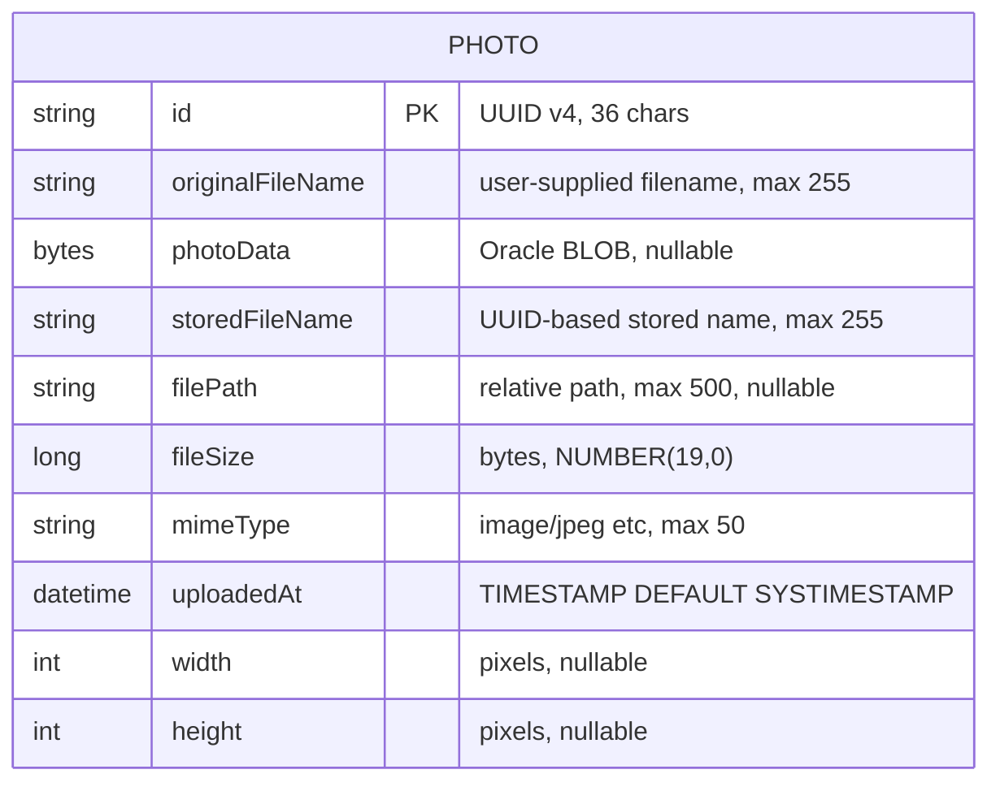

# Data Architecture & Persistence Layer

The Photo Album application uses a single Oracle Database instance as its exclusive data store, with one JPA entity (`Photo`) mapped via Hibernate ORM, storing all photo metadata and binary BLOB data in a single `PHOTOS` table.

## Database Configuration

| Service/Module | DB Type | Profile | Driver | Connection | Migration Tool |
|---------------|---------|---------|--------|------------|----------------|
| photoalbum-java-app | Oracle Database XE (Free 23ai) | default | ojdbc8 (runtime) | `jdbc:oracle:thin:@oracle-db:1521/FREEPDB1` | None — Hibernate `ddl-auto=create` recreates schema on every start |
| photoalbum-java-app | Oracle Database XE | docker | ojdbc8 (runtime) | `jdbc:oracle:thin:@oracle-db:1521:XE` | None — Hibernate `ddl-auto=create` recreates schema on every start |
| Test | H2 (in-memory) | test | H2 driver | In-memory | H2 auto-creates schema from entity metadata |

**Schema management behavior**: Hibernate auto-generates and drops the entire `PHOTOS` table on every application startup (`ddl-auto=create`). No migration tool (Flyway, Liquibase) is used, meaning schema changes cannot be tracked, versioned, or rolled back. The Oracle user (`photoalbum`) is provisioned by an init SQL script (`oracle-init/01-create-user.sql`) that runs when the Oracle container starts. The user is granted DBA-level privileges, which is over-privileged for an application user. See `configuration-inventory.md` for full property details.

## Data Ownership per Service

| Service | Tables Owned | ORM Framework | Caching | Notes |
|---------|-------------|---------------|---------|-------|
| photoalbum-java-app | PHOTOS | Hibernate 5.6 via Spring Data JPA | None | Single-table design; all photo data and BLOBs in one table |

## Entity Model

**Index**: `idx_photos_uploaded_at` on `uploaded_at` (non-unique) — supports the ordering and navigation queries that filter/sort by upload timestamp.

**Transaction management**: `PhotoServiceImpl` is annotated `@Transactional` at the class level, meaning all service methods run within a transaction by default. This ensures atomicity for upload (validate + save BLOB) and delete operations.

## Key Repository Methods

| Repository | Method Signature | Purpose | Notes |
|-----------|-----------------|---------|-------|
| PhotoRepository | `findAllOrderByUploadedAtDesc()` | Returns all photos ordered newest-first for gallery display | Native SQL; selects all columns explicitly |
| PhotoRepository | `findPhotosUploadedBefore(LocalDateTime uploadedAt)` | Returns up to 10 photos older than the given timestamp | Used for "previous" navigation; Oracle `ROWNUM <= 10` |
| PhotoRepository | `findPhotosUploadedAfter(LocalDateTime uploadedAt)` | Returns photos newer than the given timestamp | Used for "next" navigation; uses Oracle `NVL()` for null file paths |
| PhotoRepository | `findPhotosByUploadMonth(String year, String month)` | Filters photos by calendar month using Oracle `TO_CHAR()` | Oracle-specific; not portable to other databases |
| PhotoRepository | `findPhotosWithPagination(int startRow, int endRow)` | Returns a page of photos using Oracle `ROWNUM` pagination | Oracle-specific `ROWNUM` pattern; not portable to standard SQL |
| PhotoRepository | `findPhotosWithStatistics()` | Returns photos with `RANK()` and cumulative `SUM()` analytics | Oracle analytic functions; returns `List<Object[]>`, not typed entities |

**Inherited CRUD methods** (from `JpaRepository<Photo, String>`): `findById`, `findAll`, `save`, `deleteById`, `count`, `existsById`.

> **Note**: All custom queries are Oracle-specific native SQL. Migration to any other database (PostgreSQL, MySQL, Azure SQL) would require rewriting all six custom queries.

## Caching Strategy

No caching layer is implemented. The application has no Spring Cache annotations (`@Cacheable`, `@CacheEvict`), no second-level Hibernate cache configuration, no Redis/EhCache/Caffeine dependency, and no session-level query result caching. Every request to the gallery page triggers a fresh `SELECT * FROM PHOTOS ORDER BY UPLOADED_AT DESC` query returning all photos, including their BLOB data columns, which is a significant performance concern as the photo library grows. No caching rationale or design decision is documented in the codebase.

## Data Ownership Boundaries

The application uses a **single shared Oracle database instance** with a **single schema** (`photoalbum` user). There is only one service and one table, so there are no cross-service data access concerns.

All reads and writes to the `PHOTOS` table go through `PhotoRepository` via `PhotoServiceImpl`. There is no direct JDBC access, no stored procedure calls from the application layer, and no external service accessing the database. The only external interaction with the database schema is the Oracle container init script (`oracle-init/01-create-user.sql`) that creates the application user at container startup.

The use of `ddl-auto=create` means the schema is owned entirely by Hibernate's entity metadata — there is no authoritative DDL script for the `PHOTOS` table structure outside of the JPA annotations on `Photo.java`.

### Data Classification & Sensitivity

| Entity | Sensitive Fields | Classification | Controls in Place |
|--------|-----------------|----------------|-------------------|
| Photo | `originalFileName` (user-supplied filenames may reveal PII via naming conventions) | Potential PII (indirect) | None — no encryption-at-rest, no masking, no field-level access control |
| Photo | `photoData` (BLOB) | Potentially sensitive — images may contain faces, personal locations (EXIF), or private content | None — stored as plain BLOB; no encryption-at-rest, no EXIF stripping, no access control |

**Key observations**:
- Photo binary data (`photoData` BLOB) is stored unencrypted in Oracle. If the database is accessed without application authentication (no app-level auth exists), all photos are retrievable.
- EXIF metadata embedded in uploaded JPEG/PNG files (GPS coordinates, device information, timestamps) is not stripped before storage, which may expose user location and device data.
- The Oracle `photoalbum` user is granted `DBA` role — far beyond the minimum privileges required (`SELECT`, `INSERT`, `UPDATE`, `DELETE` on the `PHOTOS` table). A compromised database credential would give full administrative access to the Oracle instance.
- Database credentials (`photoalbum`/`photoalbum`) are identical for username and password and are committed in plaintext to `application.properties` and `docker-compose.yml`.
