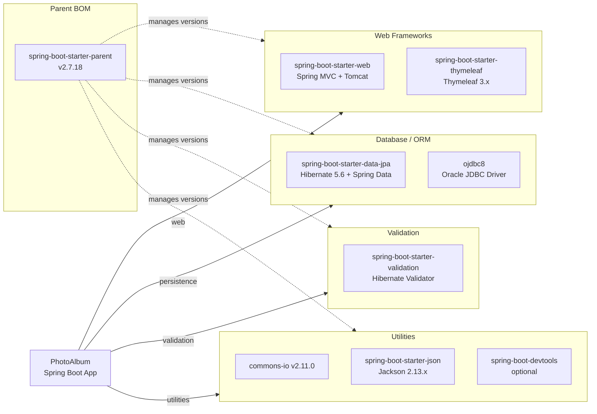

# Dependency Map

This document maps all declared external dependencies for the **Photo Album** Spring Boot application. It contains 10 declared dependencies (excluding the parent BOM) across 4 functional categories, plus 2 test-scoped dependencies.

## Dependencies

### Dependency Summary

| Category | Count | Key Libraries | Notes |
|----------|-------|---------------|-------|
| Web Frameworks | 2 | Spring MVC (embedded Tomcat), Thymeleaf 3.x | Server-side MVC + template rendering |
| Database / ORM | 2 | Spring Data JPA + Hibernate 5.6, Oracle JDBC ojdbc8 | Oracle-specific driver; no DB abstraction layer |
| Validation | 1 | Hibernate Validator (Bean Validation 2.0) | File type and size validation |
| Utilities | 3 | Apache Commons IO 2.11.0, Jackson 2.13.x, spring-boot-devtools | File streaming, JSON serialization, dev reload |

### Version & Compatibility Risks

Spring Boot 2.7.18 is the final release of the 2.7.x line, which reached **end-of-life in November 2023** and no longer receives security patches. The application targets **Java 8**, which is in long-term support via commercial vendors but is two major LTS releases behind the current Java 21 LTS. The Oracle JDBC driver (`ojdbc8`) does not have a declared version in `pom.xml` — it inherits its version from the Spring Boot BOM — which may lead to subtle compatibility issues during Spring Boot upgrades. Apache Commons IO 2.11.0 is not the latest release (2.15+ is available) and may have patched CVEs. The use of `spring.jpa.hibernate.ddl-auto=create` in application configuration is a deployment risk: it will drop and recreate schema on every start.

### Notable Observations

- **Oracle vendor lock-in**: The `ojdbc8` runtime dependency and `OracleDialect` JPA setting create hard dependencies on Oracle Database. Migrating to a different database (e.g., PostgreSQL on Azure) requires driver, dialect, and potential schema changes.
- **No security framework**: There is no `spring-boot-starter-security` dependency. The application has no authentication, authorization, or CSRF protection, making all endpoints publicly accessible.
- **No observability dependencies**: Neither Micrometer nor any metrics/tracing library is declared, meaning there is no out-of-the-box observability for cloud deployment.
- **DevTools included as optional**: `spring-boot-devtools` is declared as `optional`, which prevents it from being packaged in production JARs by default — this is correct practice but should be verified in the build pipeline.

## Test Dependencies

| Framework | Version | Notes |
|-----------|---------|-------|
| spring-boot-starter-test | 2.7.18 (managed) | Includes JUnit 5, Mockito, AssertJ, Spring Test |
| H2 Database | managed by BOM | In-memory database used as Oracle substitute during tests |

Total test-scope dependencies: **2**

The test suite uses Spring Boot's standard test starter (JUnit 5 + Mockito + AssertJ). H2 is used as an in-memory Oracle substitute for integration tests, though H2's Oracle compatibility mode may mask issues that only appear against the real Oracle driver. No contract-testing, load-testing, or Testcontainers-based integration test library is present.
