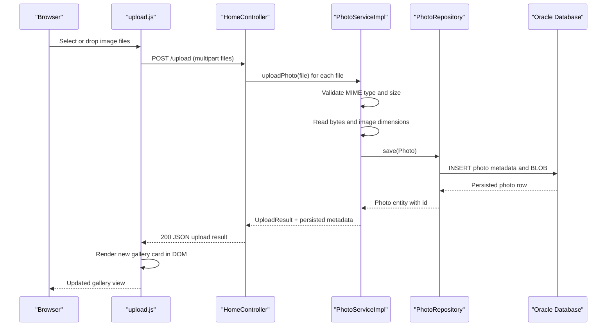

# API & Service Communication Contracts

The application exposes a small HTTP surface consisting of HTML page endpoints, one JSON upload endpoint, and a binary photo streaming endpoint. All communication is synchronous inside a single deployable Spring Boot service, with browser JavaScript calling the upload endpoint directly.

## Service Catalog

| Service | Port | Category | Purpose |
| --- | --- | --- | --- |
| photo-album | 8080 | API Layer | Serves the gallery UI, upload API, detail view, delete action, and photo binary content |
| oracle-db | 1521 | Infrastructure | Stores photo metadata and BLOB image content for the application |

## API Endpoints Inventory

| Service | Method | Path | Request Type | Response Type |
| --- | --- | --- | --- | --- |
| photo-album | GET | `/` | None | Thymeleaf `index` view with `photos` model |
| photo-album | POST | `/upload` | Multipart form field `files`; response payload assembled from `UploadResult` and `Photo` metadata | JSON object containing `success`, `uploadedPhotos`, and `failedUploads` |
| photo-album | GET | `/detail/{id}` | Path parameter `id` | Thymeleaf `detail` view with `photo`, `previousPhotoId`, and `nextPhotoId` |
| photo-album | POST | `/detail/{id}/delete` | Path parameter `id` | Redirect to `/` with flash message |
| photo-album | GET | `/photo/{id}` | Path parameter `id` | Binary image response (`ByteArrayResource`) with content type based on stored MIME type |

## Management & Observability Endpoints

| Service | Endpoint | Custom Metrics (if any) |
| --- | --- | --- |
| photo-album | None declared | No Actuator, health, metrics, Swagger, or custom metrics endpoints were found |

## DTOs & Contracts

The upload flow uses `UploadResult` as the explicit service-level DTO for reporting upload success, error text, and generated photo id. The JSON upload response is assembled ad hoc in `HomeController` from `UploadResult` plus selected `Photo` entity fields (`id`, `originalFileName`, `filePath`, `uploadedAt`, `fileSize`, `width`, `height`), so the `Photo` entity itself acts as the underlying domain contract for both rendered pages and binary retrieval. No immutable records, OpenAPI specifications, protobuf schemas, or GraphQL schemas were found. Serialization is handled by Spring Boot's default Jackson stack.

## Communication Patterns

All backend communication is synchronous and in-process: controllers call `PhotoService`, which calls `PhotoRepository`, which uses JPA/Hibernate and Oracle JDBC. The browser invokes `POST /upload` via `fetch` in `upload.js`, then updates the gallery using the returned JSON payload. No asynchronous messaging, service discovery, API gateway, circuit breaker, retry policy, or timeout customization was found. Startup availability depends on database readiness in Docker Compose because the `photoalbum-java-app` service waits for `oracle-db` to become healthy before the web application starts. No authentication, authorization, or TLS configuration was found in the application layer; the endpoints appear publicly accessible within the deployed network context.

## Service Technology Matrix

| Service | Web | Data Access | Discovery | Gateway | Actuator | Cache | Metrics |
| --- | --- | --- | --- | --- | --- | --- | --- |
| photo-album | Spring MVC + Thymeleaf | Spring Data JPA / Hibernate / Oracle JDBC | None | None | No | None | None |

## Service Communication Sequence

