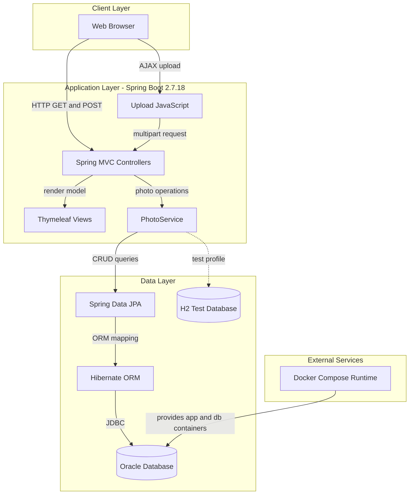
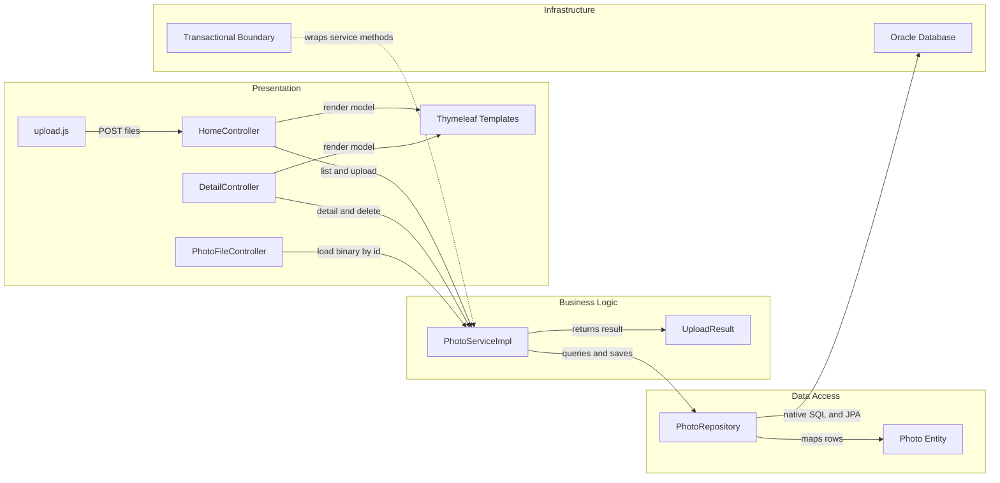

# Architecture Diagram

This repository contains a single Spring Boot web application that serves a server-rendered photo gallery and stores uploaded image binaries in a relational database. The runtime footprint is small but tightly couples the web tier, business logic, and Oracle persistence inside one deployable service.

## Application Architecture

### Technology Stack Summary

| Layer | Technology | Version | Purpose |
| --- | --- | --- | --- |
| Presentation | Thymeleaf, Bootstrap 5, Vanilla JavaScript | Thymeleaf 3.0.15, Bootstrap 5.3.0 | Server-rendered gallery UI and drag-and-drop upload UX |
| Web | Spring Boot Web / Spring MVC | Spring Boot 2.7.18, Spring Framework 5.3.31 | Routes browser requests to controllers and returns HTML or JSON |
| Business Logic | PhotoService | Custom | Validates uploads, extracts metadata, navigates previous/next photos |
| Persistence | Spring Data JPA, Hibernate | Spring Data JPA 2.7.18, Hibernate 5.6.15.Final | Maps the Photo entity and executes repository operations |
| Database | Oracle Database, H2 (tests) | ojdbc8 21.5.0.0, H2 2.1.214 | Stores photo metadata and BLOB content |
| Container Runtime | Docker, Docker Compose | Dockerfile + compose | Packages the app and starts Oracle before the web app |

### Data Storage & External Services

The production-oriented profiles use Oracle as the primary system of record, with each uploaded image stored directly in the `photos` table as a BLOB together with metadata such as file name, MIME type, size, and upload timestamp. A lightweight H2 in-memory database is used only for tests, while Docker Compose provides the runtime dependency that starts the Oracle container and waits for it to become healthy before launching the application container.

### Key Architectural Decisions

- The application is implemented as a monolith: controllers, service logic, repository access, and views are all packaged and deployed together.
- Photos are stored in the database instead of on the filesystem, avoiding shared-disk requirements but increasing database size and coupling image delivery to database availability.
- The application exposes both server-rendered pages and a small JSON upload endpoint, allowing the gallery to refresh dynamically without a separate API service.

## Component Relationships

### Component Inventory

| Component | Layer | Type | Responsibility |
| --- | --- | --- | --- |
| HomeController | Presentation | MVC Controller | Serves the gallery page and processes multi-file upload requests |
| DetailController | Presentation | MVC Controller | Renders a single photo view, navigation, and delete action |
| PhotoFileController | Presentation | MVC Controller | Streams photo BLOB content back to the browser |
| upload.js | Presentation | Browser Script | Validates selected files client-side and refreshes the gallery after upload |
| PhotoServiceImpl | Business Logic | Service | Validates uploads, extracts dimensions, persists photos, and supports navigation |
| UploadResult | Business Logic | DTO | Carries upload success or failure details between service and controller |
| PhotoRepository | Data Access | Spring Data Repository | Performs photo lookups plus Oracle-specific native queries |
| Photo | Data Access | JPA Entity | Represents persisted photo metadata and binary content |
| Oracle Database | Infrastructure | Database | Stores the `photos` table and uploaded image BLOBs |
