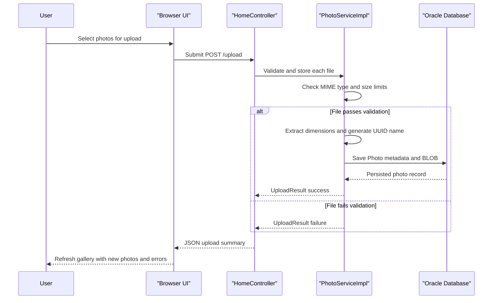

# Core Business Workflows

The application lets end users upload photos, browse them in a gallery, open a detailed view, and delete images they no longer want to keep. Its business logic is simple but centered on preserving uploaded image content together with metadata that supports browsing and navigation.

## Domain Entities

| Entity | Service / Bounded Context | Description | Key Relationships |
| --- | --- | --- | --- |
| Photo | photo-album / Photo Management | Primary domain object representing an uploaded image plus display metadata | Referenced by gallery, detail, delete, and navigation workflows |
| UploadResult | photo-album / Upload Processing | Service-level result object describing upload success or failure | Produced during upload and consumed by the upload controller response |

## Service-to-Domain Mapping

| Service | Domain Context | Owned Entities | External Dependencies |
| --- | --- | --- | --- |
| photo-album | Photo Management | `Photo`, `UploadResult` | Oracle database via JPA/Hibernate |

## Primary Workflows

### Workflow 1: Upload photos into the gallery

The browser submits one or more multipart files to `POST /upload`. `PhotoServiceImpl` validates each file's MIME type and size, reads the bytes, extracts image dimensions when possible, generates a UUID-based stored file name, and saves the resulting `Photo` record to the database. `HomeController` returns a JSON payload describing successful uploads and failures so the browser can update the gallery without a full page reload.

### Workflow 2: Browse the gallery and open a photo detail view

A user requests `GET /`, and `HomeController` loads all photos ordered by upload time for the gallery page. When a specific card is opened through `GET /detail/{id}`, `DetailController` loads the selected photo and also asks the service for the previous and next photos so that the user can navigate chronologically through the collection.

### Workflow 3: Delete a photo

From the detail page, the user submits `POST /detail/{id}/delete`. `DetailController` calls `PhotoService.deletePhoto`, which verifies the record exists and deletes the corresponding `Photo` from the database. The controller then redirects back to the gallery with a success or error flash message.

## Cross-Service Data Flows

There are no cross-service or cross-context data composition flows in this repository because the application is a single monolith backed by one database. The browser-to-server upload flow is the main data movement path: image files originate in the browser, move to the Spring Boot service, and are persisted in Oracle. The only degradation behavior observed is local error handling—failed uploads are returned in the JSON response, and missing photo ids redirect the user back to the gallery.

## Business Workflow Sequence

## Business Rules & Decision Logic

- Uploads must satisfy the configured MIME type allow-list (`image/jpeg`, `image/png`, `image/gif`, `image/webp`) and the maximum file size threshold.
- Empty files are rejected before persistence.
- Image dimensions are treated as optional metadata: if they cannot be extracted, the upload can still continue.
- Deletion first checks whether the target photo exists; nonexistent ids are treated as a user-facing error rather than a fatal exception.
- Service methods execute within Spring transactional boundaries, so create/delete operations are scoped as single database transactions.
