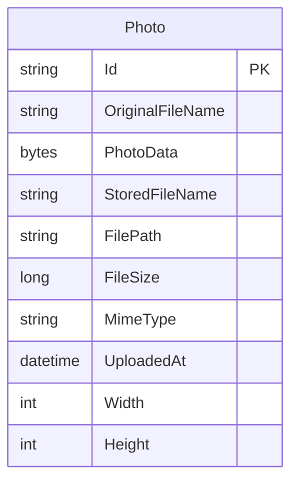

# Data Architecture & Persistence Layer

The data layer is centered on a single JPA entity backed by Oracle in the main runtime profiles and H2 during tests. Spring Data JPA and Hibernate handle persistence, while uploaded photo binaries are stored directly in the database as BLOB data.

## Database Configuration

| Service/Module | DB Type | Profile | Driver | Connection | Migration Tool |
| --- | --- | --- | --- | --- | --- |
| photo-album | Oracle | default | `oracle.jdbc.OracleDriver` | `jdbc:oracle:thin:@oracle-db:1521/FREEPDB1` | None; Hibernate `ddl-auto=create` manages schema |
| photo-album | Oracle | docker | `oracle.jdbc.OracleDriver` | `jdbc:oracle:thin:@oracle-db:1521:XE` | None; Hibernate `ddl-auto=create` manages schema |
| photo-album | H2 | test | `org.h2.Driver` | `jdbc:h2:mem:testdb` | None; Hibernate `ddl-auto=create-drop` manages schema |

## Data Ownership per Service

| Service | Tables Owned | ORM Framework | Caching | Notes |
| --- | --- | --- | --- | --- |
| photo-album | `photos` | Spring Data JPA + Hibernate | None | Single-service ownership; photo binaries and metadata live in one table |

## Entity Model

## Key Repository Methods

| Service | Repository | Notable Methods | Purpose |
| --- | --- | --- | --- |
| photo-album | `PhotoRepository` | `findAllOrderByUploadedAtDesc()` | Returns gallery rows ordered newest-first using native Oracle SQL |
| photo-album | `PhotoRepository` | `findPhotosUploadedBefore(LocalDateTime uploadedAt)` | Supports previous-photo navigation using Oracle `ROWNUM` pagination |
| photo-album | `PhotoRepository` | `findPhotosUploadedAfter(LocalDateTime uploadedAt)` | Supports next-photo navigation and uses `NVL` in the native query |
| photo-album | `PhotoRepository` | `findPhotosByUploadMonth(String year, String month)` | Demonstrates Oracle `TO_CHAR` date filtering for monthly lookups |
| photo-album | `PhotoRepository` | `findPhotosWithPagination(int startRow, int endRow)` | Returns a page of photos using Oracle row-number based pagination |
| photo-album | `PhotoRepository` | `findPhotosWithStatistics()` | Uses Oracle analytic functions for rankings and running totals |

## Caching Strategy

No application-level caching provider or Spring Cache annotations were found. Every gallery load, photo detail request, navigation lookup, and binary photo retrieval goes directly through the repository to the database, so the effective strategy is uncached read-through database access. Browser-side cache busting is used in the UI by appending timestamps to `/photo/{id}` requests, but that does not introduce a server-side cache.

## Data Ownership Boundaries

The application uses a shared, single-database topology because there is only one deployable service and one owned table. Cross-service data access patterns are absent; controllers call the service layer, which delegates all persistence to `PhotoRepository`. Reads and writes are performed inside the monolith's transactional boundary, with no CQRS split, outbox pattern, or replicated read model.

### Data Classification & Sensitivity

| Entity | Sensitive Fields | Classification (PII/PHI/PCI/None) | Controls in Place |
| --- | --- | --- | --- |
| Photo | `originalFileName`, `photoData` | PII (potential user-identifiable metadata and uploaded image content) | No explicit encryption-at-rest, masking, or field-level access controls found in application code or configuration |
