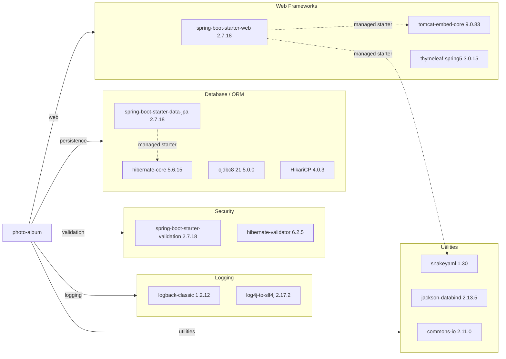

# Dependency Map

The `photo-album` project is a Maven-built Spring Boot application with roughly 20 non-test dependencies once starters and key transitives are grouped by function. The dependency set centers on web MVC, JPA/Hibernate, Oracle JDBC, template rendering, and JSON processing.

## Dependencies

### Dependency Summary

| Category | Count | Key Libraries | Notes |
| --- | --- | --- | --- |
| Web Frameworks | 3 | spring-boot-starter-web, tomcat-embed-core, thymeleaf-spring5 | MVC web stack with embedded Tomcat and server-side templates |
| Database / ORM | 4 | spring-boot-starter-data-jpa, hibernate-core, ojdbc8, HikariCP | Oracle-centric persistence layer with connection pooling |
| Security | 2 | spring-boot-starter-validation, hibernate-validator | Bean validation only; no authn/authz framework present |
| Logging | 2 | logback-classic, log4j-to-slf4j | Standard Spring Boot logging bridge stack |
| Utilities | 3 | commons-io, jackson-databind, snakeyaml | File helpers, JSON serialization, YAML config parsing |

### Version & Compatibility Risks

The project targets Java 8 and Spring Boot 2.7.x, both of which constrain modernization and leave the application on an older framework baseline. AppCAT and the dependency CVE scan both highlight outdated transitive dependencies such as Tomcat 9.0.83, SnakeYAML 1.30, Jackson 2.13.5, and Logback 1.2.12, while the Oracle JDBC driver and Oracle-specific native queries increase portability effort for cloud migration.

### Notable Observations

- Most functionality is inherited through Spring Boot starters, so a small set of direct dependencies expands into a fairly deep transitive tree.
- The repository layer relies on Oracle-specific SQL functions such as `ROWNUM`, `NVL`, and `TO_CHAR`, making the persistence layer less portable than a pure derived-query/JPA approach.
- There are no dedicated observability, metrics, caching, or security framework dependencies beyond validation support.
- Test dependencies are isolated to the Spring Boot test starter and H2, which keeps production dependencies focused but leaves limited integration-test tooling.

## Test Dependencies

| Framework | Version | Notes |
| --- | --- | --- |
| spring-boot-starter-test | 2.7.18 | Aggregates Spring Boot test support, JUnit 5, Mockito, JSON Assert, and Hamcrest |
| junit-jupiter | 5.8.2 | Primary unit/integration test engine |
| mockito-core / mockito-junit-jupiter | 4.5.1 | Mocking support from the Spring Boot test starter |
| H2 Database | 2.1.214 | In-memory database used by the `test` Spring profile |

Total test-scope dependencies: 4

The test setup is lightweight and suitable for context-load validation, but there is no dedicated containerized or end-to-end integration testing library in the declared dependencies.
